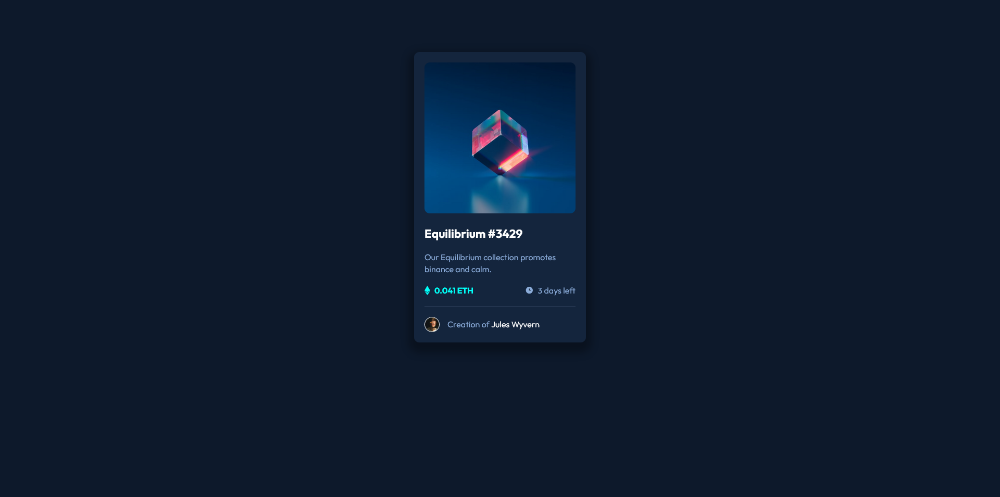

# NFT Preview Card

The [NFT Preview Card](https://farhdibehnamdev.github.io/NFT-Preview-Card/) is designed to practice and explore basic HTML , CSS.

The template is a guide meant for you to explore and change to ✨*make it your own*✨

## Table of contents

- [Overview](#overview)
  - [So how do I use this?](#So-how-do-I-use-this)
  - [The challenge](#the-challenge)
  - [Screenshot](#screenshot)
  - [Links](#links)
- [My process](#my-process)
  - [Built with](#built-with)
  - [helpful resources](#helpful-resources)
- [Created a masterpiece? 🎨 Share it!](#Created-a-masterpiece)

## So how do I use this?

1. Download the files ⬇️
2. Open in a text editor of your choice and change the place holder content to your hearts content 💛
3. Of course, I have used Visual Studio Code.

### The challenge

Users should be able to:

- View the optimal layout depending on their device's screen size
- See hover states for interactive elements

### Screenshot

### Links

- Live Site URL: [NFT Preview Card](https://farhdibehnamdev.github.io/NFT-Preview-Card/)

## My process

### Built with

- Semantic HTML5 markup
- Flexbox
- Grid

## helpful resources

#### Fonts

- Family: [Outfit](https://fonts.google.com/specimen/Outfit)

## Colors

### Primary

- Soft blue: hsl(215, 51%, 70%)
- Cyan: hsl(178, 100%, 50%)

### Neutral

- Very dark blue (main BG): hsl(217, 54%, 11%)
- Very dark blue (card BG): hsl(216, 50%, 16%)
- Very dark blue (line): hsl(215, 32%, 27%)
- White: hsl(0, 0%, 100%)

#### CSS

- [Mozilla Developer Network: Beginners Guide to CSS](https://developer.mozilla.org/en-US/docs/Learn/CSS/Introduction_to_CSS)

## Created a masterpiece? 🎨 Share it!

If so, please fork this repo and add a link to this README.md or create an issue with the github page link and to have it added to the README.md.
